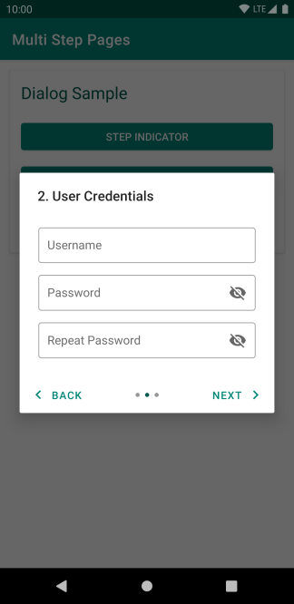

# Multi Step Pages

Multi Step Pages is an Android library that allows the creation of sequential UX flows with minimal effort.

 

# Usage

## Import

[](https://mvnrepository.com/artifact/com.umbraltech/multisteppages)

### Gradle

```
implementation 'com.umbraltech:multisteppages:x.y.z'  
```


## Components

Currently, the only component available in the library to represent sequential flows is the multi-step dialog. The component can be used as follows:

```kotlin
// Creation
val dialog = MultiStepDialogFragment.create("Dialog Title", listOf(steps), indicator)

// Display
dialog.show(fragmentManager, "tag")
```

## Steps

Each step is represented by the `Step` class, which takes the following parameters:
- `title: String` - Title shown for the step, unused if null or not provided
- `layoutRes: Int` - Layout resource used for the step, required
- `layoutListener: StepLayoutListener` - Invoked when the layout is created, can be used for initializing the UI for the step
- `advanceListener: StepAdvanceListener` - Invoked when pressing the next button for the step. Can be used to perform validation on the current step and prevent advancement.

### StepLayoutListener

Contains a single function as a parameter, `onLayout(View)`, that is executed when the layout for the step is constructed. The input to the function is the step view.

### StepAdvanceListener

Contains four optional functions as parameters (`onPreExecute`, `onExecute`, `onPostExecute`, and `onError`) and two generic types (`PreExecuteResult`, `ExecuteResult`). The first of the three functions are executed sequentially, whereas the error function is executed if an Exception is thrown in any of the other functions. If an Exception is thrown in an execution function, then the rest of the functions will not execute for that step.

Function parameters:
1. `onPreExecute(View): PreExecuteResult` - Takes the step view as input, is executed on the main thread, and returns a result.
2. `onExecute(PreExecuteResult): ExecuteResult` - Takes the result of the previous function as input, is executed on an IO thread, and returns a result.
3. `onPostExecute(View, ExecuteResult): Boolean` - Takes the step view and result of the previous function as inputs and is executed on the main thread. Returns true if the next page should be loaded and false otherwise. 
4. `onError(View, Throwable)` - Takes the step view and the throwable from the error as inputs and is executed on the main thread.

Generic types:
1. `PreExecuteResult` - Type of the value returned by onPreExecute
2. `ExecuteResult` - Type of the value returned by onExecute

## Indicators

There are currently three types of indicators supported to show the current step and step count:
1. Bar - Shows a progress bar that is filled until the current step
2. Step - Shows circular step icons for each step, and highlights the current step
3. None - Shows nothing

# Sample

A sample application using the library can be found under the `app` directory.

# Limitations & Issues

The following are limitations and issues that currently exist with the library.

1. Step layouts must use the match_parent value for width and height attributes. This is because ViewPager2, the component used for paging, does not support top level component using wrap_content. 
2. In order to persist a view's value across pause/resume states and configuration changes, the view must be assigned an ID. This is because we call `saveHierarchyState` to save the state and `restoreHierarchyState` to restore the state, which requires IDs.
3. When using step dialogs, there may be visual artifacts if the height of the first page is smaller than any of the other pages. This is because we dynamically resize the dialogs based on the content.
4. There are currently no styling options available for the indicators or pages.

These limitations and issues will be worked upon and resolved over time. Contributions are always welcome.